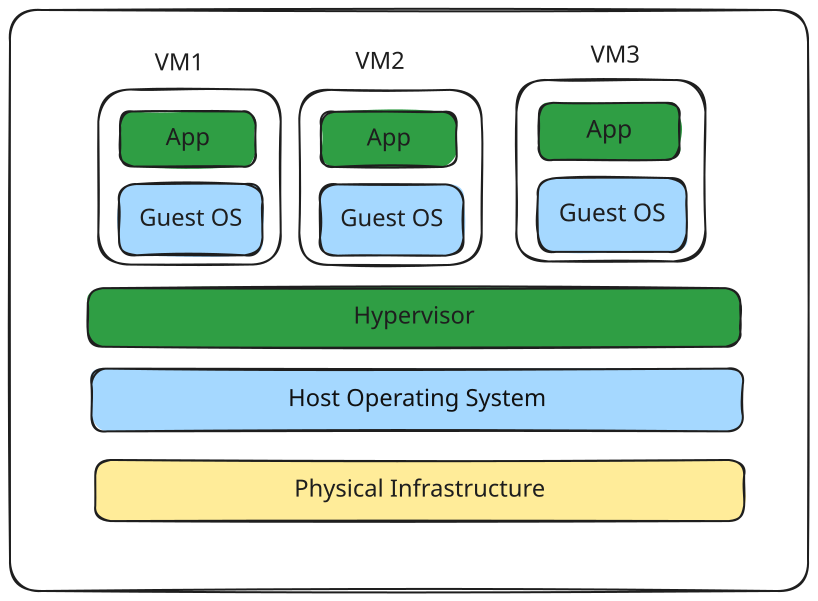
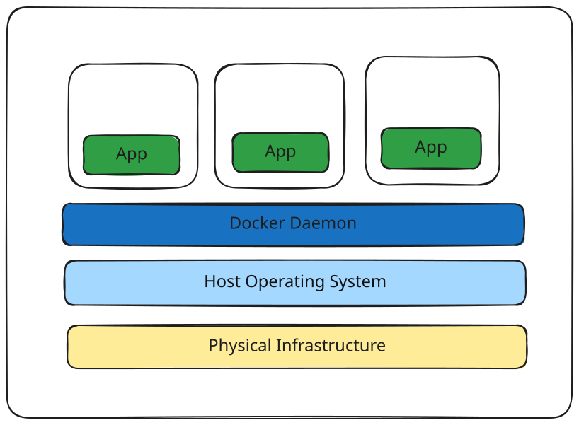
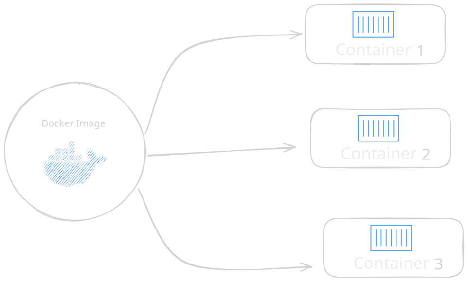
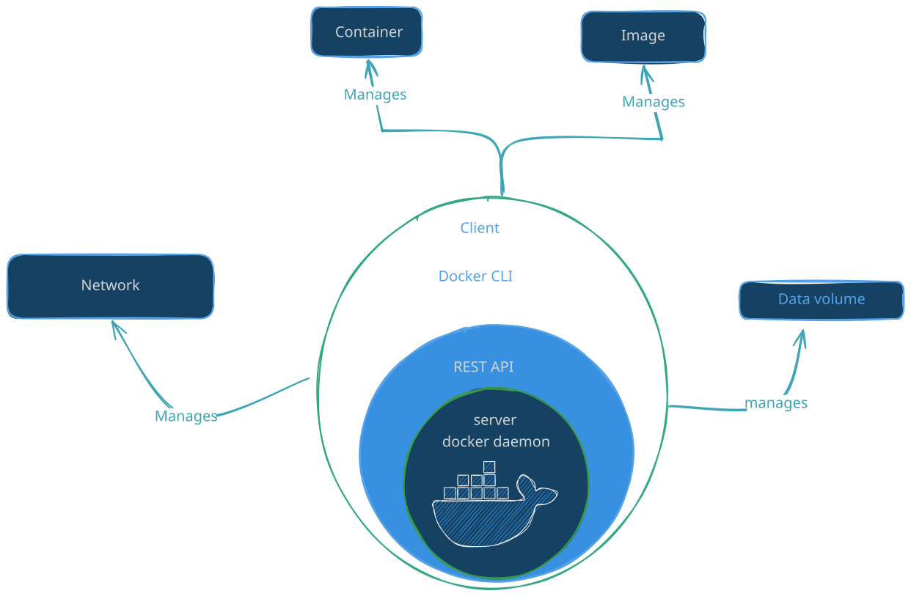
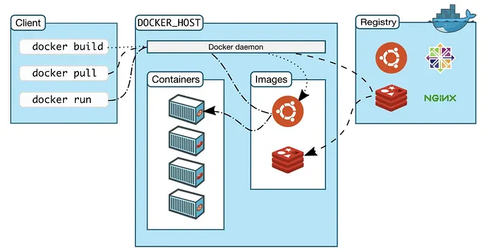

You remember the story, right?

Your band started out great at home. Perfect sound, perfect setup.

But when you traveled, things fell apart.

You needed a van with everything inside, so your music stayed consistent everywhere you played.

In tech, we have the same problem.

Apps run perfectly on one machine... and then break somewhere else. Maybe a file is missing, the software version is wrong, or there's just a weird bug that only happens "there" and not "here."

We don't just need our code. We need the full setup. Every single time.

A **container** is like that band van. It carries everything your app needs to run:

- The code
- The environment
- The tools
- The libraries and settings

It's not tied to any one machine. It works anywhere.

So instead of saying "it worked on my machine," we can say:

> _"It works in the container."_

**Docker containers are not Virtual Machines.**

Think of a container as an isolated process, not a mini computer.

Let's compare them side by side. We'll start by looking at what it takes to run multiple applications on a server using VMs, one layer at a time.

## Let's Start With Virtual Machines

Imagine that you have a server and you want to run three applications on it.
You want each application to be isolated from the others.
One way to achieve this is with **Virtual Machines**.

Let's start from the bottom and work our way up.

### 1. The Infrastructure

At the bottom, we have our physical infrastructure, This is whatever hardware you're running on.

This could be:

- Your laptop
- A dedicated server in a data center
- A cloud server such as an Amazon EC2 instance or a DigitalOcean server

Something has to provide the CPU, memory, storage, and networking that our applications will eventually use.

### 2. Host Operating System

On top of that infrastructure runs an operating system. On your laptop, this might be macOS, Windows, or a Linux distribution. When we're talking about VMs, this is usually called the **host operating system**.

You can think of a VM as a self-contained computer packed into a single file. But something needs to be able to run that file, that's where the **hypervisor** comes in.

## 3. The Hypervisor

There are two types:

### Type 1 - _Direct link to the infrastructure_

Connects directly to the infrastructure. It talks straight to the hardware.

Examples: HyperKit (macOS), Hyper-V (Windows).

### Type 2 - _Runs as an application on top of your host operating system_

Examples: VirtualBox and VMware.

Type 1 hypervisors are more efficient because they bypass the host OS and talk to the hardware directly. But don't read too much into that, Type 2 hypervisors are still very capable.

The important thing isn't really which type you choose for our discussion.

The important thing is this:

> **The hypervisor is responsible for creating and managing Virtual Machines.**

And now we can create our VMs.

## 4. The Guest Operating System

Let's say we want to run 3 applications on your server, fully isolated from each other. That means spinning up 3 guest operating systems, all managed by your hypervisor. They can be the same OS or different ones, it doesn't matter.

Here's the problem: each guest OS might take up around 700 MB. Multiply that by 3, and you're already using **2.1 GB just for guest operating systems** before your applications even come into the picture.

It gets worse. Each guest OS also needs its own CPU and memory, plus its own copy of various binaries and libraries just to let things run wherever your application needs to go.

The more applications we run, the more of these environments we may need.



This is a story of running a VMs on the server now let compare that to Docker.

## Now Let's Talk About Containers

Docker containers are practically magic bullets. We still need some kind of **Infrastructure** to run them, just like VMs this could be your laptop or any server in the cloud. Then we have a **Host OS**, which can be anything capable of running Docker, typically a major Linux distribution. On top of that, we have the **Docker daemon**.

1. **Infrastructure**: same as with VMs, it can be your laptop or any server.
2. **Host Operating System**: also the same as with VMs.
3. **Docker Daemon**: a service that runs in the background on the host OS and manages everything needed to run and interact with Docker containers.
4. **Binaries and Libraries**: same idea as with VMs, but instead of living inside a guest OS, they're packed into special packages called **Docker images**, which the _*Docker daemon*_ runs.

The last piece is our applications. Each one ends up living inside a Docker image and is managed independently by the Docker daemon. Each application and its libraries typically get packed into the same image, and each stays isolated from the others.



Notice what's missing?

There is no guest operating system for every application.

That's the big difference.

Notice there are a lot fewer moving parts with Docker. We don't need a hypervisor or a VM. Instead, the Docker daemon talks directly to the host OS and knows how to reach into resources for running containers. It's also an expert at keeping each container isolated, both from the OS and from other containers.

Containers share the host operating system's **kernel**, while providing isolation between applications.

And this is why I like the phrase:

> **Think of containers as isolated processes.**

A container isn't pretending to be an entire computer.

It's running a process in an isolated environment.

### So Where Do the Libraries and Dependencies Go?

You might be thinking:

> "Wait a minute. If containers don't have their own operating system, what happens to all the libraries and dependencies my application needs?"

Good question.

This is where **Docker Images** come in.

Remember our band van from Part 1?

The van wasn't useful just because it was a van.

It was useful because we put everything our band needed inside it. The same idea applies here.

We package our application together with the things it needs into a **Docker image**.

For example:

```text
Docker Image
│
├── Application
├── Application dependencies
├── Libraries
├── Runtime
└── Configuration
```

The image becomes our application's packaged environment.

Then Docker uses that image to create a **container**.

And this distinction is extremely important:

> **An image is the package. A container is a running instance of that package.**

Think about it like this:



One image can be used to create multiple containers.

For example, if you have a Node.js application, you can build one image for it and then run multiple containers from that image.

Each container runs its own instance of the application while sharing the underlying host kernel.

# VM vs Container

Now the difference should start becoming clearer.

With Virtual Machines:

> **Every VM has its own guest operating system.**

With containers:

> **Containers share the host operating system's kernel.**

That's why containers can be much lighter and faster to start than full Virtual Machines.

Instead of booting an entire operating system, Docker can start the application process inside an isolated container environment.

**But Don't Throw Your VMs Away Yet**

At this point, you might be thinking:

> _"Okay, Docker is faster and smaller. So why would anyone use VMs anymore?"_

Don't.

Virtual Machines are not bad.

Docker didn't replace VMs.

They solve different problems.

I like to think about it this way:

> **VMs isolate systems.**

> **Containers isolate applications.**

Imagine you run a web hosting company.

You have three customers, and you want to give each customer their own isolated server environment.

A VM makes a lot of sense.

Each customer gets their own operating system and isolated environment.

Now imagine you're building a web application.

You have:

```text
Frontend
API
Background Worker
```

You might want to run each application independently.

That's where containers become very useful.
You don't need three complete operating systems just to run three applications.

## **The House and Apartment Analogy**

Think of a **Virtual Machine as a house** and a **Docker container as an apartment**.

Houses are fully self-contained and protected from unwanted guests. They have their own infrastructure — plumbing, heating, an electrical system — along with a bedroom, living area, bathroom, and kitchen. If you only want a place to sleep and use the bathroom, it's hard to find a house that fits just that.

Apartments also protect you from unwanted guests, but they're built around shared infrastructure, plumbing, heating, and electrical systems are shared across the building. Apartments also come in different sizes, from a tiny studio to a penthouse, so you can pick the size that matches exactly what you need.

To sum it up: Docker containers share resources with your host OS through the Docker daemon, while VMs do not.

## Can VMs and Docker Work Together?

Yes, very much so.

Most cloud hosting providers, like DigitalOcean or AWS, don't actually give you a dedicated physical machine. Instead, they set you up with a virtual machine that has specific hardware limits matching the plan you signed up for. You're very likely sharing the same physical server with thousands of other users, but each of you is isolated in your own VM.

You can also run Docker directly on dedicated hardware, with no VM involved.
So the stack can look like:

> **Physical Server → Virtual Machine → Operating System → Docker → Containers**

And that's perfectly normal.

This is one of the reasons it's important not to think of Docker and VMs as competing technologies.

They can complement each other.

## Okay, So What Actually Is Docker?

Docker as a whole is made up of many different tools, but when most people talk about installing and using Docker, they mean the **Docker daemon** and the **Docker CLI**.

The **Docker daemon** is a service that runs on your host OS. It only runs on Linux, because it depends on a number of Linux kernel features. The daemon exposes a _REST API_, and from there, a number of different tools can talk to it through that API. The most widely used one is the **Docker CLI** a command-line tool that lets you talk to the Docker daemon directly.

When you install Docker, you get both the daemon and the CLI together. You can describe this setup as a client-server application: the daemon is the server, and the CLI is one of many possible clients. There are third-party clients written for the Docker daemon in pretty much every popular programming language, and you can even write your own, since you're really just interfacing with a well-defined API.

The **Docker daemon** is a background service responsible for managing Docker resources.

It can:

- Create containers
- Start containers
- Stop containers
- Remove containers
- Build and manage images
- Manage networks
- Manage volumes

You can think of the daemon as the part of Docker that actually does the work.



But if the daemon is doing the work, how do **we** tell it what to do?

That's where the Docker CLI comes in.
The **Docker CLI** When you type:

```bash
docker ps
```

or:

```bash
docker run nginx
```

you're using the **Docker CLI**.

The CLI is the tool we use to communicate with Docker.

So the relationship looks like this:

You give the CLI a command.

The CLI communicates with the Docker daemon.

The daemon performs the requested operation.

## Docker Is a Client-Server Architecture

This is an important concept because the Docker CLI and Docker daemon don't necessarily have to run on the same machine.

The Docker daemon exposes an API.

Clients can communicate with that API.

The Docker CLI is simply the most common client. But the CLI isn't the only possible client.

You can have other tools or applications communicate with the Docker daemon through its API.

So you can think of Docker as a client-server application:



This also means that the client and daemon don't necessarily have to live on the same machine.

### The Docker Host

The machine running the Docker daemon is commonly called the **Docker host**.

You could have the Docker CLI on your laptop and communicate with a Docker daemon running on a remote server.

That's a powerful concept.

You don't necessarily need to be sitting in front of the machine where the containers are running.

### What About macOS and Windows?

This is where things can become a little confusing.

If you're using Linux, the Docker daemon can run directly on the Linux host because containers rely heavily on Linux kernel features.

But macOS and Windows don't provide the same Linux kernel environment.

So when you use **Docker Desktop** on macOS or Windows, Docker provides a Linux environment, typically through a lightweight virtual machine, where the Docker daemon runs.

Just remember:

> **The Docker CLI is the client. The Docker daemon is the component that manages the containers.**

### And Then There Is the Docker Registry

There's one more piece you'll encounter very often:

**Docker registries.**

For now, don't worry about all the details.

Think of a registry as a place where Docker images can be stored and shared.

For example, you might build an image on your laptop and push it to a registry.

Later, a server can pull that image and run it as a container.

This is how the Docker image you build on your machine can eventually become the container running on a server somewhere else.

And now our original van analogy makes even more sense.

You pack everything your application needs into the image, you store or share that image, another machine can retrieve the image.

Docker uses it to create a container.

And your application can run in that environment without you manually setting up all its dependencies again.

### Putting Everything Together

Let's step back for a moment.

We started this article with a simple question:

> **How is Docker different from a Virtual Machine?**

Now we have an answer.

A Virtual Machine virtualizes an entire computer.

A container doesn't need to do that.

Instead, containers provide an isolated environment for processes while sharing the host operating system's kernel.

And Docker provides the tooling that makes working with those containers practical.

And if you want to remember only a few things from this article, remember these:

### 1. Containers are not Virtual Machines

They are isolated processes that share the host operating system's kernel.

### 2. An image is not a container

An **image** is the packaged template.

A **container** is a running instance of that image.

### 3. Docker has a client and a daemon

The **Docker CLI** lets you communicate with Docker.

The **Docker daemon** manages Docker resources.

### 4. Containers and VMs solve different problems

> **VMs isolate entire systems.**

> **Containers isolate applications.**

### 5. They can work together

You can absolutely run Docker inside a Virtual Machine.

## One Last Look at Our Band

Remember our band?

At the beginning, we had a problem.

Every time we traveled, something was different.

Something was missing.

Something was configured differently.

Something broke.

So we packed our entire setup into a van.

But now we understand something we didn't understand before.

The van isn't just carrying our instruments.

It's giving us a **consistent way to move our entire setup from one place to another**.

That's what makes Docker so useful.

We can package an application and its dependencies into an image, move that image somewhere else, and create a container from it.

Same application.

Same dependencies.

Same environment.

Different machine.

If you want to read more, check out the [official Docker documentation](https://docs.docker.com/get-started/docker-overview/#the-underlying-technology).

And that brings us to the next question:

> **Okay, enough theory. How do we actually install Docker and run our first container?**

That's exactly what we'll do in the next part.
